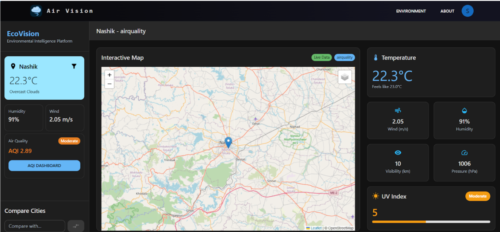
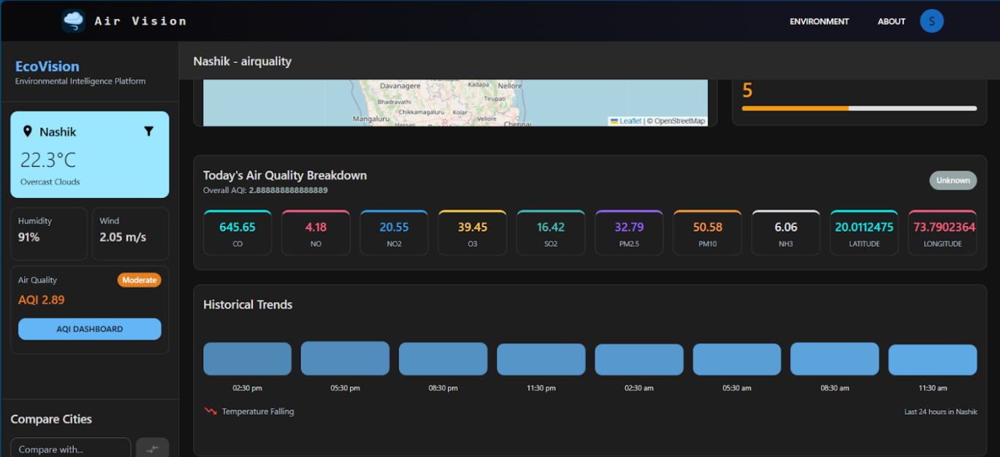
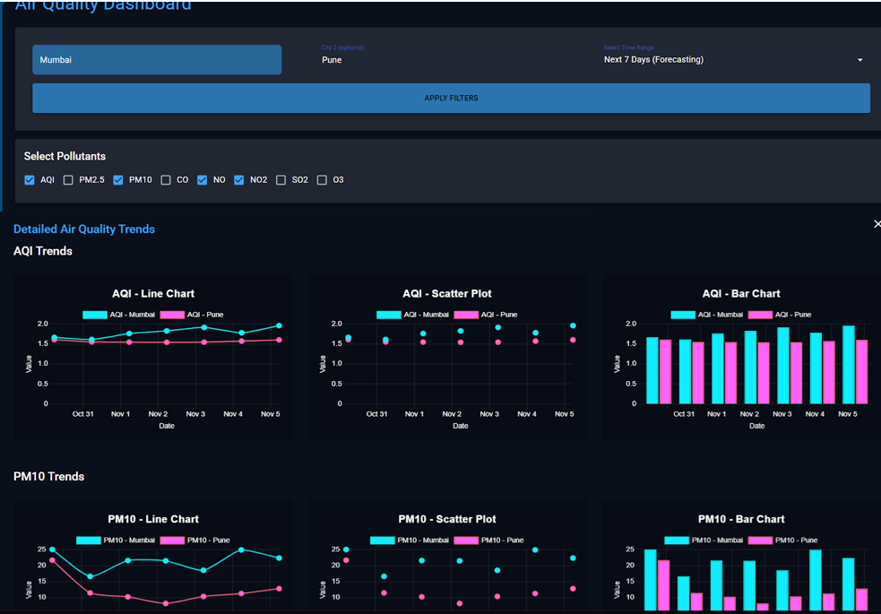

# 🌍 AirVision – Air Quality Monitoring & Prediction System

AirVision is a full-stack web application that provides **real-time air quality monitoring** and **7-day AQI forecasting** using a Deep Learning (LSTM) model. It combines live environmental data, interactive visualizations, and predictive analytics to help users monitor and understand air quality trends.

---

## 🚀 Features

- 📍 Real-time Air Quality Index (AQI) monitoring
- 🤖 7-day AQI prediction using an LSTM Deep Learning model
- 🌎 City-wise air quality search
- 📊 Interactive dashboards and historical trend visualization
- 🔐 Secure JWT-based authentication
- 📱 Responsive and user-friendly interface
- ⚡ REST API integration with live weather and pollution services

---

## 🛠️ Tech Stack

**Frontend**
- React.js
- HTML5
- CSS3
- Tailwind CSS

**Backend**
- Node.js
- Express.js

**Machine Learning**
- Python
- TensorFlow
- Scikit-learn
- LSTM (Long Short-Term Memory)

**Database**
- MongoDB

**APIs**
- OpenWeather API

---

## 🧠 Machine Learning

The prediction engine uses an **LSTM-based Deep Learning model** trained on historical air quality data to forecast pollutant levels and AQI for the next **7 days**.

---

## 📸 Screenshots









---

## 🔑 Environment Variables

Create a `.env` file in the server directory.

```env
PORT=5000
MONGO_URI=<Your MongoDB URI>
JWT_SECRET=<Your JWT Secret>
OPENWEATHER_API_KEY=<Your API Key>
```

---

## 📈 Future Enhancements

- 🔔 AQI alerts and notifications
- 🗺️ Interactive pollution heatmaps
- 📱 Mobile application
- ☁️ Cloud deployment
- 🛰️ Satellite data integration
- 🤖 Advanced prediction models

---

## 👥 Contributors

- **Nikhil Mishra** – Project Lead, Full-Stack Development, Machine Learning Integration, Backend Development, API Development, System Design
- **<Contributor Name>** – Frontend Development, UI/UX Enhancement, Responsive Design Implementation

---

## 👨‍💻 Author

**Nikhil Mishra**

📧 **Email:** nikhiltmishraa@gmail.com

🔗 **LinkedIn:** https://www.linkedin.com/in/nikhil-mishra-7a6bba259

💻 **GitHub:** https://github.com/NIKHIL-MISHRA-COAT

🌐 **Portfolio:** https://nikhilmishraportfolio.vercel.app/